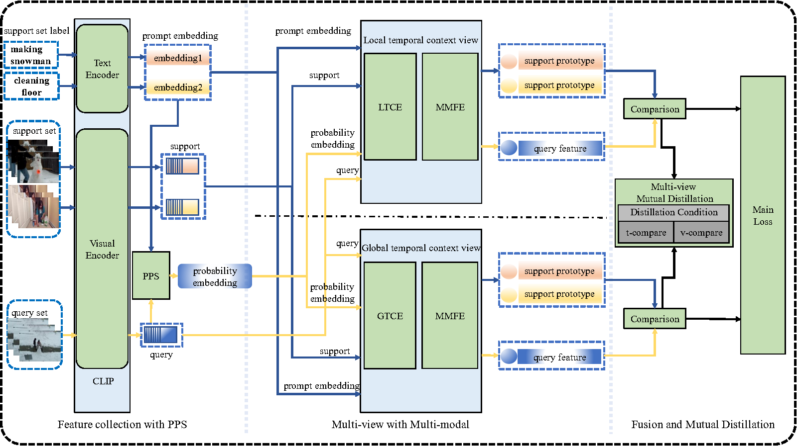
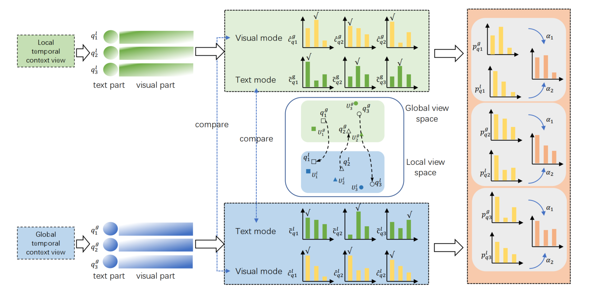

##  Multi-view Distillation based on Multi-modal Fusion for Few-shot Action Recognition(CLIP-MDMF)

## Frame work of the paper

## Distillation Process in our work

[Paper] (https://arxiv.org/abs/2401.08345)

        
This paper has been accepted by Knowledge based systems.(https://doi.org/10.1016/j.knosys.2024.112539)

This repo contains code for the method introduced in the paper:
(https://github.com/cofly2014/CLIP-MDMF)

[Multi-view Distillation based on Multi-modal Fusion for Few-shot Action Recognition]

## Where to download the dataset

##TODO

## How to configure the multiple level Segment Transformer
##TODO

## Splits
We used https://github.com/ffmpbgrnn/CMN for Kinetics and SSv2, which are provided by the authors of the authors of [CMN](https://openaccess.thecvf.com/content_ECCV_2018/papers/Linchao_Zhu_Compound_Memory_Networks_ECCV_2018_paper.pdf) (Zhu and Yang, ECCV 2018). We also used the split from [OTAM](https://openaccess.thecvf.com/content_CVPR_2020/papers/Cao_Few-Shot_Video_Classification_via_Temporal_Alignment_CVPR_2020_paper.pdf) (Cao et al. CVPR 2020) for SSv2, and splits from [ARN](https://www.ecva.net/papers/eccv_2020/papers_ECCV/papers/123500511.pdf) (Zhang et al. ECCV 2020) for HMDB and UCF.  These are all the in the splits folder.

## Citation
If you use this code/method or find it helpful, please cite:

    @article{GUO2024112539,
    title = {Multi-view distillation based on multi-modal fusion for few-shot action recognition (CLIP-MDMF)},
    journal = {Knowledge-Based Systems},
    volume = {304},
    pages = {112539},
    year = {2024},
    issn = {0950-7051},
    doi = {https://doi.org/10.1016/j.knosys.2024.112539},
    url = {https://www.sciencedirect.com/science/article/pii/S0950705124011730},
    author = {Fei Guo and YiKang Wang and Han Qi and Wenping Jin and Li Zhu and Jing Sun},
    }
 

## Acknowledgements

We based our code on [CLIP-FSAR  CLIP-guided Prototype Modulating for Few-shot Action Recognition IJCV' 2023](https://github.com/alibaba-mmai-research/CLIP-FSAR) (logging, training, evaluation etc.).
Our paper also referred the work  [Active Exploration of Multimodal Complementarity for Few-Shot Action Recognition CPVR' 2023](https://ieeexplore.ieee.org/document/10203554/similar#similar)
We use [torch_videovision](https://github.com/hassony2/torch_videovision) for video transforms. 
We took inspiration from the image-based [CrossTransformer](https://proceedings.neurips.cc/paper/2020/file/fa28c6cdf8dd6f41a657c3d7caa5c709-Paper.pdf) 